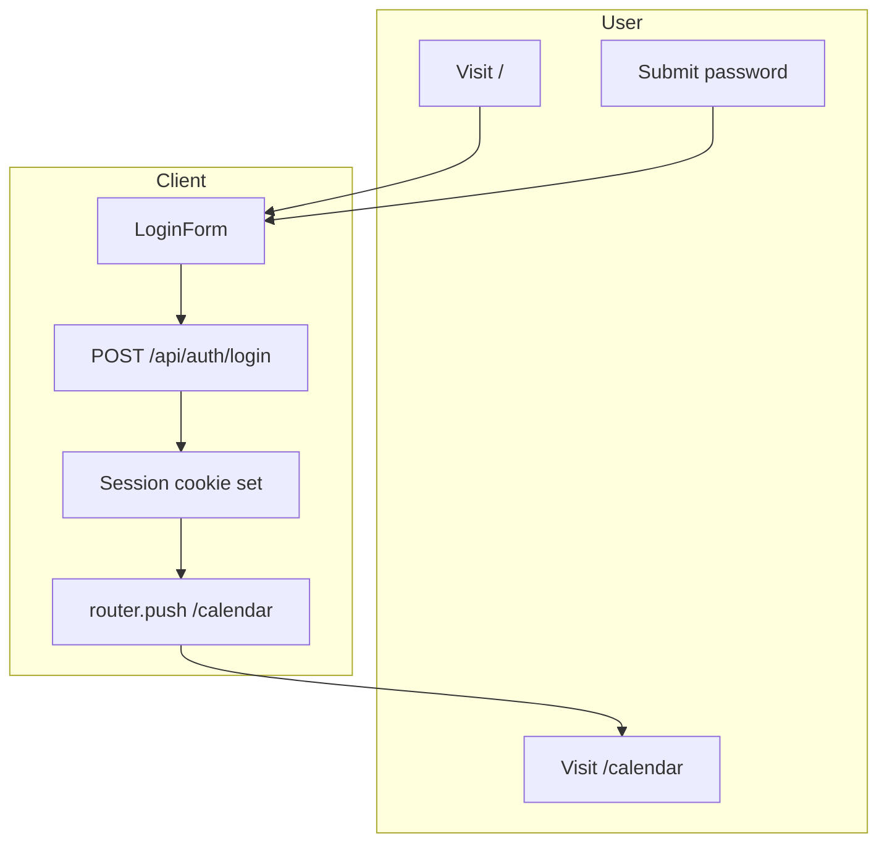

# Calendario Condiviso — Architecture

Shared calendar for teams and families. This document describes the system architecture as implemented.

---

## Tech Stack

| Layer | Technology |
|-------|------------|
| Framework | Next.js 16 (App Router) |
| Language | TypeScript |
| Styling | Tailwind CSS v4 |
| UI Components | shadcn/ui (Radix + Tailwind) |
| Storage | Turso (libSQL/SQLite) |
| Auth | bcryptjs (password hash), iron-session (cookie) |
| Validation | Zod |
| Hosting | Vercel |

---

## Route Structure

| Route | Purpose | Protection |
|-------|---------|------------|
| `/` | Login page | Redirects to `/calendar` if authenticated |
| `/calendar` | Main calendar (monthly/weekly views) | Protected (AuthGuard) |
| `/admin` | Admin setup + backup controls | Open when no password; requires auth when configured |
| `/api/events` | Events CRUD | Requires session |
| `/api/auth/*` | Login, logout, session | Public (login) or session |
| `/api/config/*` | Password config | Public (password-set) or session |
| `/api/backup` | Export/import backup | Requires session |

---

## Layout Hierarchy

- **Root layout** (`src/app/layout.tsx`): viewport, fonts (Geist, Geist Mono), Toaster, AuthProvider
- **Flat page structure**:
  - `app/page.tsx` — login
  - `app/calendar/page.tsx` — calendar (AuthGuard, BackupControls)
  - `app/admin/page.tsx` — admin setup / backup

---

## Auth Flow

- **Password storage**: bcrypt hash (cost 10) in Turso `config` table
- **Session**: iron-session cookie (httpOnly, server-side)
- **AuthProvider** (`src/lib/auth-context.tsx`): provides `login`, `logout`, `isPasswordSet`
- **AuthGuard** (`src/components/auth-guard.tsx`): redirects to `/` if not authenticated
- **Login flow**: POST `/api/auth/login` → verify password → set session cookie → redirect to `/calendar`



---

## Data Model (Turso/SQLite)

### `config` table

Single-row app-wide settings.

| Column | Type | Description |
|--------|------|-------------|
| `id` | text (PK) | `"default"` |
| `password_hash` | text | bcrypt hash of admin password |
| `updated_at` | text | ISO datetime |

### `eventi` table

| Column | Type | Description |
|--------|------|-------------|
| `id` | text (PK) | UUID |
| `titolo` | text | Event title |
| `descrizione` | text | Optional description |
| `data_inizio` | text | ISO datetime |
| `data_fine` | text | ISO datetime |
| `tipo` | text | `affidamento` \| `scuola` \| `sport` \| `altro` |
| `creato_da` | text | Optional creator label |
| `creato_il` | text | ISO datetime |
| `modificato_il` | text | ISO datetime |

---

## API Module

| Module | Location | Responsibility |
|--------|----------|----------------|
| **API Client** | `lib/api.ts` | getEvents, createEvent, updateEvent, deleteEvent, auth, backup |
| **API Routes** | `app/api/` | Server-side handlers for events, auth, config, backup |

---

## Backup Format (JSON)

```json
{
  "version": 1,
  "exportedAt": "2025-03-07T12:00:00.000Z",
  "config": { "passwordHash": "...", "updatedAt": "..." },
  "events": [ { "id": "...", "titolo": "...", ... } ]
}
```

- **Esporta backup**: GET `/api/backup` → download JSON
- **Carica backup**: POST `/api/backup` → replace or merge (validated server-side)

---

## Data Flow

```mermaid
flowchart LR
    subgraph Client
        UI[Calendar UI]
        Login[Login Form]
        Backup[BackupControls]
    end

    subgraph API
        Events[/api/events]
        Auth[/api/auth]
        BackupAPI[/api/backup]
    end

    subgraph Turso
        DB[(eventi, config)]
    end

    Login --> Auth
    UI --> Events
    Backup --> BackupAPI
    Events --> DB
    Auth --> DB
    BackupAPI --> DB
```

---

## Module Boundaries

| Module | Location | Responsibility |
|--------|----------|----------------|
| **Auth** | `lib/auth-context.tsx`, `lib/session.ts`, `app/api/auth/` | Session, login/logout, route protection |
| **API** | `lib/api.ts`, `app/api/` | Client API, server routes, Turso/Drizzle |
| **Calendar** | `app/calendar/` | Monthly/weekly views, event blocks |
| **Events** | `lib/validations/events.ts`, `app/calendar/event-form*.tsx` | Validation, create/edit forms |
| **Admin** | `app/admin/`, `components/backup-controls.tsx` | Password setup, backup export/import |

---

## Key Files

| Path | Purpose |
|------|---------|
| `src/lib/auth-context.tsx` | AuthProvider, login/logout, session state |
| `src/lib/api.ts` | Client API for events, auth, backup |
| `src/lib/session.ts` | iron-session helpers |
| `src/lib/auth.ts` | Server-side password verify/set |
| `src/lib/db.ts` | Drizzle Turso client |
| `db/schema.ts` | Drizzle schema (config, eventi) |
| `src/components/auth-guard.tsx` | Protects routes |
| `src/components/backup-controls.tsx` | UI for backup download/upload |
